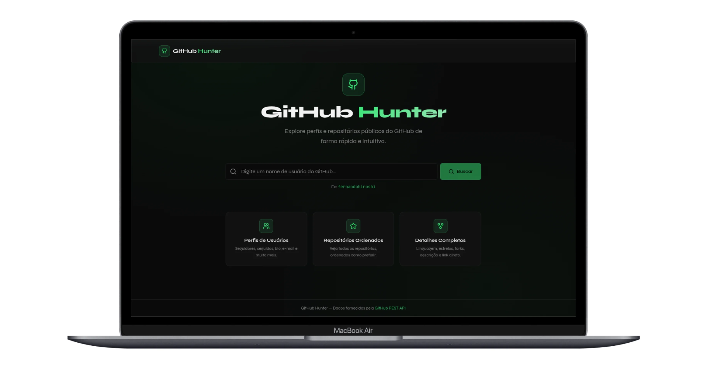
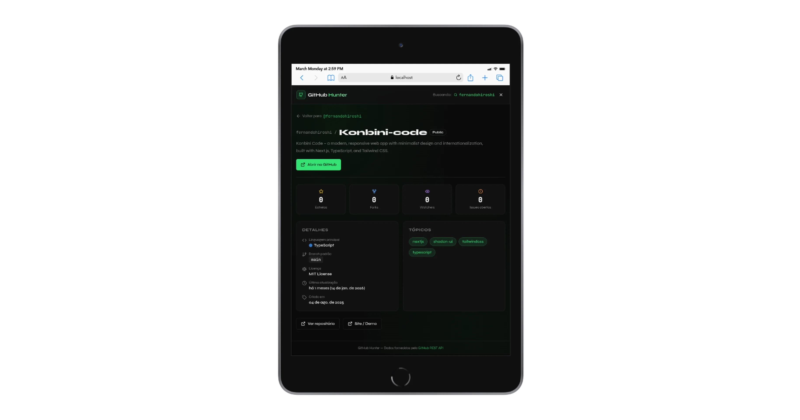

# 🔍 GitHub Hunter

Aplicação web construída com **React + TypeScript** que consome a **[GitHub REST API](https://docs.github.com/en/rest)** para buscar perfis de usuários e explorar seus repositórios públicos.

**MVP / Demo:** https://githubhunter.vercel.app



---

## ✨ Funcionalidades

- **Busca de usuários** por nome de usuário do GitHub
- **Perfil completo**
  - Avatar, nome, bio
  - E-mail, localização, empresa, website e Twitter (quando disponível)
  - Seguidores/seguindo e total de repositórios públicos
- **Listagem de repositórios** com ordenação por:
  - Estrelas (maior/menor)
  - Nome (A→Z / Z→A)
  - Data de atualização (mais recente/mais antiga)
- **Página de detalhes** de cada repositório
  - Linguagem principal (com cor por linguagem)
  - Estrelas, forks, watchers, issues
  - Licença, branch padrão, datas e tópicos
  - Link direto para o repositório e (quando existir) homepage/demo
- **Estados de loading, erro e vazio** tratados
- **Responsivo** (mobile-first)
- **Acessibilidade**
  - `aria-label` em controles relevantes
  - Navegação por teclado em cards clicáveis

---

## 📱 Responsividade

O layout foi pensado para funcionar bem em telas pequenas e grandes.


---

## 🛠️ Stack Tecnológica

| Categoria       | Tecnologia                              |
| --------------- | --------------------------------------- |
| Framework       | React 18 + TypeScript                   |
| Build           | Vite 5                                  |
| Roteamento      | React Router DOM v6                     |
| Estado global   | Zustand (com `devtools`)                |
| HTTP            | Axios                                   |
| UI Components   | shadcn/ui (Radix UI primitives)         |
| Estilização     | Tailwind CSS v3 + `tailwindcss-animate` |
| Fontes          | Syne + JetBrains Mono (Google Fonts)    |
| Ícones          | Lucide React                            |
| Testes          | Vitest + Testing Library (`jsdom`)      |
| Package manager | pnpm                                    |

---

## 🚀 Como executar

### Pré-requisitos

- Node.js **>= 18**
- pnpm **>= 9**

### Instalação

```bash
# Clone o repositório
git clone https://github.com/<seu-usuario>/github-hunter.git
cd github-hunter

# Instale as dependências
pnpm install

# Inicie o servidor de desenvolvimento
pnpm dev
```

A aplicação estará disponível em `http://localhost:5173`.

### Outros comandos

```bash
# Build para produção
pnpm build

# Preview do build de produção
pnpm preview

# Rodar testes (watch)
pnpm test

# Testes com UI interativa
pnpm test:ui

# Relatório de cobertura
pnpm test:coverage

# Lint
pnpm lint
```

---

## 🧭 Rotas

| Rota                             | Página                                    |
| -------------------------------- | ----------------------------------------- |
| `/`                              | Tela inicial com busca                    |
| `/user/:username`                | Perfil do usuário + lista de repositórios |
| `/user/:username/repo/:repoName` | Detalhes do repositório                   |
| `*`                              | Página 404                                |

---

## 🧠 Arquitetura (como funciona)

### Fluxo principal

- **Busca**
  - O componente `SearchBar` navega para `/user/:username`.
  - A `UserPage` reage ao parâmetro da rota e chama `searchUser(username)` no Zustand.

- **Store global (Zustand)**
  - Arquivo: `src/store/searchStore.ts`
  - Responsabilidades:
    - Guardar `query`, `user`, `repositories`, flags de loading e erros
    - Buscar usuário e repositórios em paralelo via `Promise.allSettled`
    - Armazenar a opção de ordenação e expor `getSortedRepositories()`

- **Camada de serviços (API)**
  - Arquivo: `src/services/github.ts`
  - Usa uma instância do Axios (`baseURL: https://api.github.com`).
  - Tratamento de erros com mensagens amigáveis (ex: 404, 403 rate limit, problemas de rede).
  - Repositórios são paginados (`per_page=100`) com um _safety cap_ para evitar loop infinito.

- **Detalhe do repositório**
  - Página: `src/pages/RepositoryDetailPage.tsx`
  - Primeiro tenta encontrar o repositório no estado global.
  - Se não encontrar, faz um fetch fallback buscando todos os repositórios do usuário.

---

## 📁 Estrutura de Pastas

```text
src/
├── components/
│   ├── layout/          # Header, Footer
│   ├── search/          # SearchBar
│   ├── user/            # UserCard, UserCardSkeleton
│   ├── repository/      # RepositoryCard, RepositoryList, skeletons
│   └── ui/              # Componentes shadcn (Button, Card, Badge, etc.)
├── pages/
│   ├── HomePage.tsx
│   ├── UserPage.tsx
│   ├── RepositoryDetailPage.tsx
│   └── NotFoundPage.tsx
├── store/
│   └── searchStore.ts   # Zustand store global
├── services/
│   └── github.ts        # Camada de API (Axios)
├── hooks/               # Custom hooks (extensível)
├── types/
│   └── github.ts        # Interfaces TypeScript
├── utils/
│   ├── cn.ts            # clsx + tailwind-merge
│   ├── format.ts        # Formatação de números e datas
│   ├── sort.ts          # Ordenação de repositórios
│   └── languageColors.ts # Cores por linguagem
├── test/
│   ├── setup.ts         # Configuração global do Testing Library
│   ├── mocks.ts         # Dados mockados reutilizáveis
│   ├── sort.test.ts
│   ├── format.test.ts
│   ├── SearchBar.test.tsx
│   ├── UserCard.test.tsx
│   ├── RepositoryCard.test.tsx
│   └── github.service.test.ts
├── App.tsx              # Rotas
├── main.tsx             # Entry point
└── index.css            # Estilos globais + tokens CSS
```

---

## 🧪 Testes

O projeto usa **Vitest** com ambiente **`jsdom`** e `@testing-library/jest-dom`.

- **Utilitários**
  - `sortRepositories`
  - `formatNumber`, `formatDate`, `formatRelativeDate`, `truncate`
- **Componentes**
  - `SearchBar`, `UserCard`, `RepositoryCard`
- **Serviços**
  - `github.ts` (tratamento de erros)

---

## 🔒 Segurança & Boas Práticas

- Links externos usam `rel="noopener noreferrer"`
- Input de busca tem:
  - `maxLength={39}` (limite real de username do GitHub)
  - `pattern` para restringir formato válido
- Sem armazenamento de tokens/dados sensíveis
- URLs de blog são normalizadas para `https://` quando necessário

---

## ☁️ Deploy (Vercel)

**Demo:** https://githubhunter.vercel.app

O comando de build do projeto é:

```bash
pnpm build
```

Se o ambiente de build bloquear scripts de pós-instalação, o projeto já inclui a configuração do pnpm para permitir o build do `esbuild`:

```json
{
  "pnpm": {
    "onlyBuiltDependencies": ["esbuild"]
  }
}
```

---

## 🖼️ Preview (tablet)



---

## 📝 Commits Convencionais

O histórico de commits segue o padrão **[Conventional Commits](https://www.conventionalcommits.org/)**.

---

## 📄 Licença

MIT
